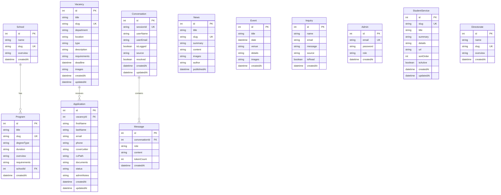

# 🗄 Database Schema Documentation

This document describes the database schema for the KeMU University Prototype.

**Database:** SQLite  
**ORM:** Prisma 5.7  
**Schema File:** `kemu-backend/prisma/schema.prisma`

---

## 📊 Entity-Relationship Diagram



---

## 📋 Model Descriptions

### School
Represents academic schools/faculties in the university.

| Field | Type | Description |
|-------|------|-------------|
| `id` | Int | Primary key |
| `name` | String | School name |
| `slug` | String | URL-friendly identifier (unique) |
| `overview` | String? | Description of the school |
| `programs` | Program[] | Related academic programs |
| `createdAt` | DateTime | Creation timestamp |

---

### Program
Academic programs offered by schools.

| Field | Type | Description |
|-------|------|-------------|
| `id` | Int | Primary key |
| `title` | String | Program name |
| `slug` | String | URL-friendly identifier (unique) |
| `degreeType` | String | Certificate/Diploma/Degree/Masters/PhD |
| `duration` | String? | Program duration (e.g., "4 Years") |
| `overview` | String? | Program description |
| `requirements` | String? | Entry requirements |
| `schoolId` | Int | Foreign key to School |
| `createdAt` | DateTime | Creation timestamp |

**Relationships:** Belongs to one School (cascade delete)

---

### News
News articles and announcements.

| Field | Type | Description |
|-------|------|-------------|
| `id` | Int | Primary key |
| `title` | String | Article title |
| `slug` | String | URL-friendly identifier (unique) |
| `summary` | String? | Brief summary |
| `content` | String | Full article content |
| `images` | String? | JSON array of image URLs (up to 5) |
| `author` | String? | Author name |
| `publishedAt` | DateTime | Publication date |

---

### Event
University events and activities.

| Field | Type | Description |
|-------|------|-------------|
| `id` | Int | Primary key |
| `title` | String | Event title |
| `date` | DateTime | Event date and time |
| `venue` | String | Event location |
| `details` | String? | Event description |
| `images` | String? | JSON array of image URLs |
| `createdAt` | DateTime | Creation timestamp |

---

### Vacancy
Job openings at the university.

| Field | Type | Description |
|-------|------|-------------|
| `id` | Int | Primary key |
| `title` | String | Job title |
| `slug` | String | URL-friendly identifier (unique) |
| `department` | String | Department name |
| `location` | String | Campus location |
| `type` | String | Academic/Administrative/Support |
| `description` | String | Job description |
| `requirements` | String | Job requirements |
| `deadline` | DateTime | Application deadline |
| `images` | String? | JSON array of image URLs |
| `createdAt` | DateTime | Creation timestamp |
| `updatedAt` | DateTime | Last update timestamp |
| `applications` | Application[] | Related applications |

---

### Application
Job applications submitted by candidates.

| Field | Type | Description |
|-------|------|-------------|
| `id` | Int | Primary key |
| `vacancyId` | Int | Foreign key to Vacancy |
| `firstName` | String | Applicant first name |
| `lastName` | String | Applicant last name |
| `email` | String | Contact email |
| `phone` | String | Contact phone |
| `coverLetter` | String | Cover letter text |
| `cvPath` | String | Path to uploaded CV file |
| `documents` | String? | JSON array of document paths |
| `status` | String | Application status (default: "pending") |
| `adminNotes` | String? | Admin notes |
| `createdAt` | DateTime | Submission timestamp |
| `updatedAt` | DateTime | Last update timestamp |

**Status Values:** `pending`, `reviewing`, `shortlisted`, `interview`, `rejected`, `hired`

**Relationships:** Belongs to one Vacancy (cascade delete)

---

### Inquiry
Contact form submissions and inquiries.

| Field | Type | Description |
|-------|------|-------------|
| `id` | Int | Primary key |
| `name` | String | Sender name |
| `email` | String | Sender email |
| `message` | String | Inquiry message |
| `source` | String | "contact-form" or "chatbot" |
| `isRead` | Boolean | Read status (default: false) |
| `createdAt` | DateTime | Submission timestamp |

---

### Admin
Administrator accounts for the CMS.

| Field | Type | Description |
|-------|------|-------------|
| `id` | Int | Primary key |
| `email` | String | Login email (unique) |
| `password` | String | Hashed password |
| `role` | String | User role (default: "admin") |
| `createdAt` | DateTime | Creation timestamp |

---

### Conversation
AI chatbot conversation sessions.

| Field | Type | Description |
|-------|------|-------------|
| `id` | Int | Primary key |
| `sessionId` | String | Unique session identifier |
| `userName` | String? | User's name (if provided) |
| `userEmail` | String? | User's email (if provided) |
| `isLogged` | Boolean | Whether conversation is logged |
| `source` | String? | Source (default: "chatbot_ai") |
| `resolved` | Boolean | Marked as resolved (default: false) |
| `messages` | Message[] | Related messages |
| `createdAt` | DateTime | Creation timestamp |
| `updatedAt` | DateTime | Last update timestamp |

---

### Message
Individual messages in a chat conversation.

| Field | Type | Description |
|-------|------|-------------|
| `id` | Int | Primary key |
| `conversationId` | Int | Foreign key to Conversation |
| `role` | String | 'user', 'assistant', or 'system' |
| `content` | String | Message text |
| `tokenCount` | Int? | Token count for billing |
| `createdAt` | DateTime | Creation timestamp |

**Relationships:** Belongs to one Conversation (cascade delete)

---

### StudentService
Student services information pages.

| Field | Type | Description |
|-------|------|-------------|
| `id` | Int | Primary key |
| `slug` | String | URL-friendly identifier (unique) |
| `title` | String | Service title |
| `summary` | String | Main description |
| `details` | String? | JSON array of detail points |
| `url` | String? | External link |
| `sortOrder` | Int | Display order (default: 0) |
| `isActive` | Boolean | Active status (default: true) |
| `createdAt` | DateTime | Creation timestamp |
| `updatedAt` | DateTime | Last update timestamp |

---

### Directorate
University directorates/departments.

| Field | Type | Description |
|-------|------|-------------|
| `id` | Int | Primary key |
| `name` | String | Directorate name |
| `slug` | String | URL-friendly identifier (unique) |
| `overview` | String? | Description |
| `createdAt` | DateTime | Creation timestamp |

---

## 🔧 Database Commands

```bash
# Generate Prisma client
npm run prisma:generate

# Create and run migrations
npm run prisma:migrate

# Seed database with sample data
npm run prisma:seed

# Open Prisma Studio (GUI)
npx prisma studio
```

---

## 📍 Database Location

The SQLite database file is located at:
```
kemu-backend/prisma/dev.db
```
